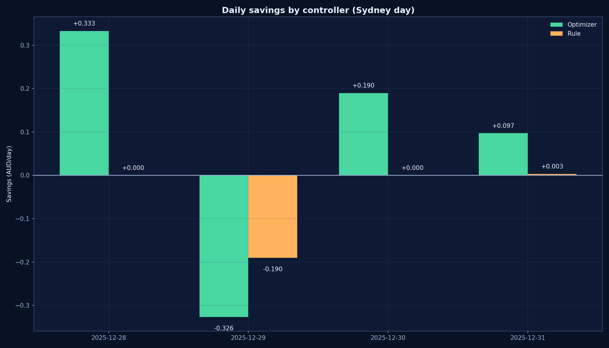
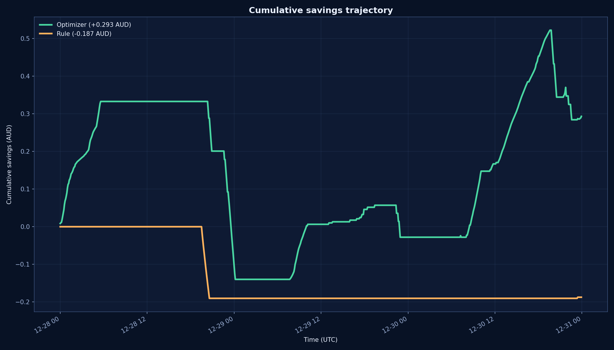
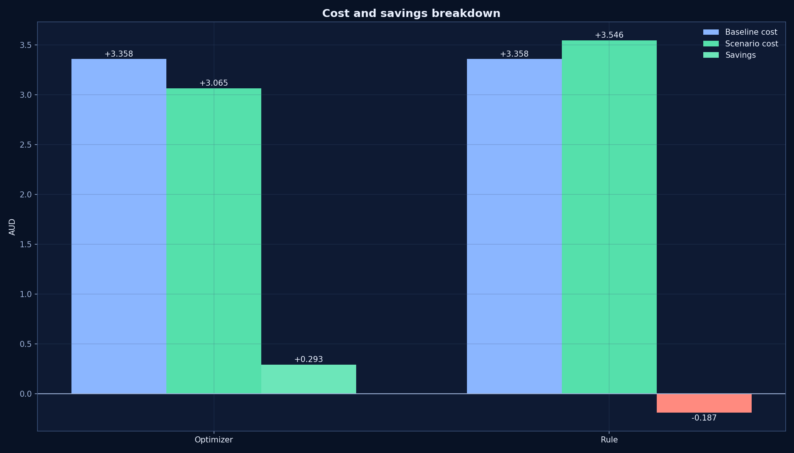
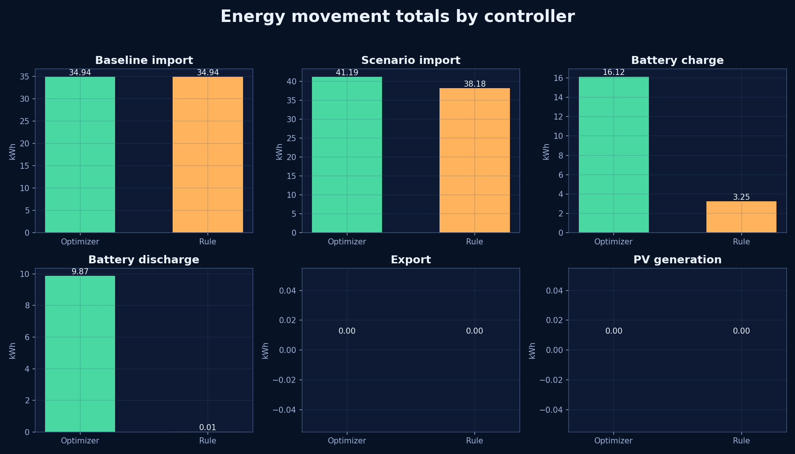
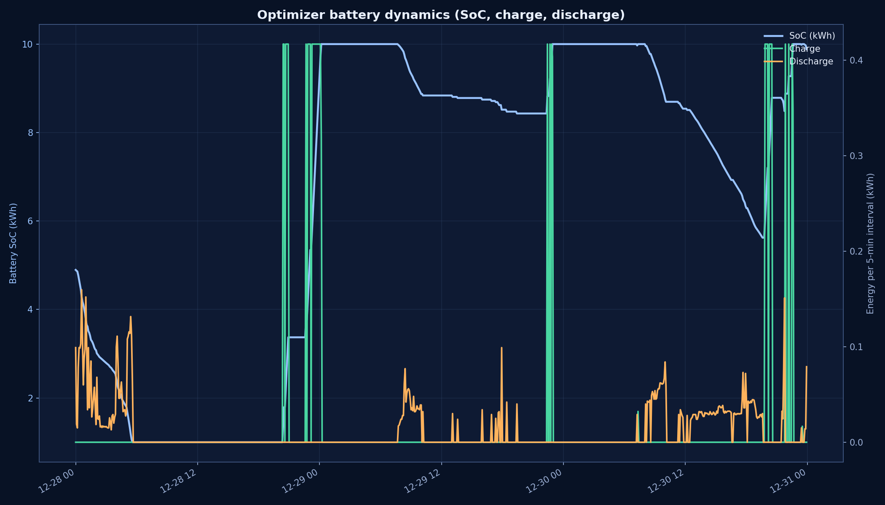
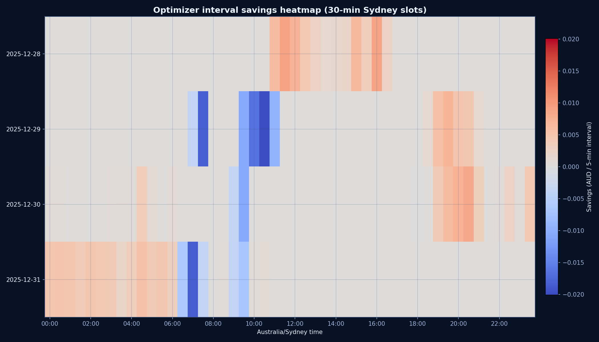
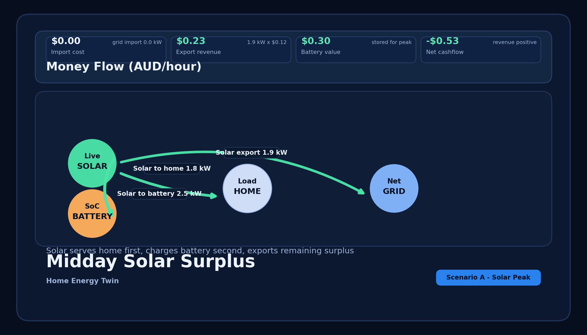
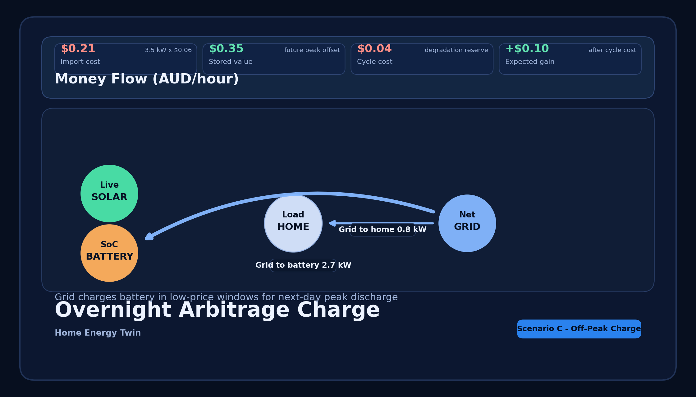

# Home Energy Digital Twin
## Professional Model + Results Walkthrough

Date: 2026-02-08

---

# Executive summary

This digital twin estimates how your home would perform with:
- `10 kW` rooftop PV
- `10 kWh` Tesla-style battery
- price-aware dispatch with optional export arbitrage

The model runs at 5-minute resolution and publishes dashboard-ready outputs (status, KPIs, interval series, energy-flow decomposition, money-flow decomposition).

---

# Layer 1: baseline economics (no PV, no battery)

At each interval `t`:
- Load `E_load,t` (kWh)
- Amber price `p_t` (AUD/kWh)

Baseline:
- `E_import_baseline,t = E_load,t`
- `Cost_baseline,t = E_import_baseline,t * p_t`

All scenario gains/losses are measured against this baseline.

---

# Layer 2: PV physics

PV output uses irradiance/weather near Vaucluse NSW:
- `E_pv,t = P_dc * (G_t / 1000) * delta_t * PR * TempFactor`

Assumptions:
- `P_dc = 10 kW`
- `PR = 0.82`
- temperature coefficient `-0.004 / degC`

---

# Layer 3: battery dynamics

Battery assumptions:
- capacity `10 kWh`
- reserve `1 kWh`
- initial SoC `5 kWh`
- charge/discharge/export limit `5 kW`
- round-trip efficiency `90%`
- degradation term `0.02 AUD/kWh discharged`

State transition:
- `SoC_{t+1} = clip(SoC_t + eta_c*E_charge,t - E_discharge,t/eta_d, [SoC_min, SoC_max])`

---

# Layer 4: dispatch and objective

Two controllers:
- `rule`: fixed thresholds
- `optimizer`: rolling lookahead quantiles/spread logic

Objective:
- minimize scenario cost while satisfying physical limits

Scenario cost:
- `Cost_scenario,t = Import_t*p_t - Export_t*p_t + Degradation_t`

Savings:
- `Savings_t = Cost_baseline,t - Cost_scenario,t`

---

# Runtime architecture (offline-first)

```mermaid
flowchart LR
  A[Amber usage/prices] --> C[SQLite cache]
  B[Supabase history] --> D[Simulation orchestrator]
  C --> D
  E[Open-Meteo irradiance] --> D
  D --> F[simulation_intervals]
  D --> G[simulation_runs]
  F --> H[/api/simulation/intervals]
  G --> I[/api/simulation/status]
  F --> J[/api/simulation/flow]
  H --> K[/simulation dashboard]
  I --> K
  J --> K
```

---

# Key results (latest cached run)

| Controller | Today savings | MTD savings | Next 24h projected |
|---|---:|---:|---:|
| Optimizer | `+0.0576 AUD` | `+0.2538 AUD` | `+0.0394 AUD` |
| Rule | `+0.0000 AUD` | `-0.1903 AUD` | `+0.0030 AUD` |

Interpretation:
- optimizer extracted more value from intra-day price movement.

---

# Daily savings comparison



---

# Cumulative savings trajectory



---

# Cost and savings breakdown



---

# Energy movement totals



---

# Battery operation profile (optimizer)



---

# Interval savings heatmap (optimizer)



---

# Tesla-style flow view: midday solar surplus



---

# Tesla-style flow view: evening peak support


---

# Tesla-style flow view: overnight charge



---

# Dashboard UX implementation notes

Main dashboard improvements:
- upgraded visual hierarchy and status chips
- simulation freshness/savings integrated into Data Status card

Simulation dashboard improvements:
- directional energy-flow board with separate ports to avoid ambiguous crossing
- explicit money-flow strip (import, export, avoided cost, degradation, net, savings)
- stale flags and `as_of` displayed in header and status chips

---

# Operational behavior

Live mode:
- timer every 5 minutes
- writes summaries + interval rows to SQLite
- dashboard endpoints remain cache-first

Exposed APIs:
- `GET /api/simulation/status`
- `GET /api/simulation/intervals?window=today|mtd|next24h`
- `GET /api/simulation/flow`

All payloads include `as_of` and stale semantics.

---

# Recommended next upgrades

1. deterministic weather fallback when remote weather API unavailable
2. optional LP/MILP dispatch backend
3. tariff asymmetry + fixed/network charge support
4. EV/V2H coupling
5. automated reconciliation confidence report

---

# Repro steps

```bash
.venv/bin/python scripts/run_scenario_simulation.py --mode backtest --controller optimizer --site-id 01J061Q7Q883JF26YMGZVVTMV9 --start 2025-12-28T00:00:00Z --end 2025-12-31T00:00:00Z

.venv/bin/python scripts/run_scenario_simulation.py --mode backtest --controller rule --site-id 01J061Q7Q883JF26YMGZVVTMV9 --start 2025-12-28T00:00:00Z --end 2025-12-31T00:00:00Z

MPLBACKEND=Agg MPLCONFIGDIR=/tmp .venv/bin/python scripts/generate_simulation_presentation_pngs.py
.venv/bin/python scripts/generate_flow_mockup_pngs.py
.venv/bin/python scripts/export_simulation_pptx_with_keynote.py
```
